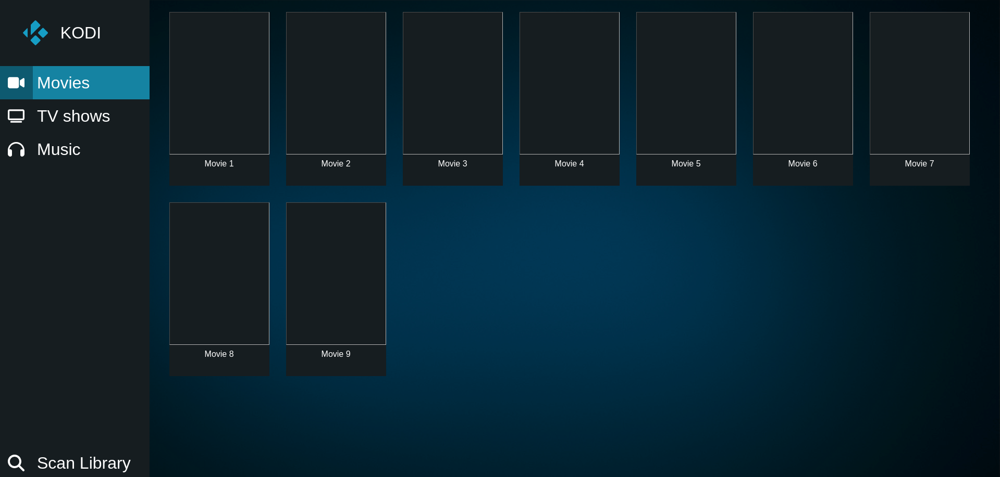
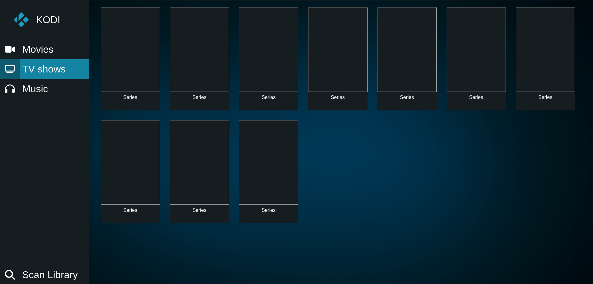
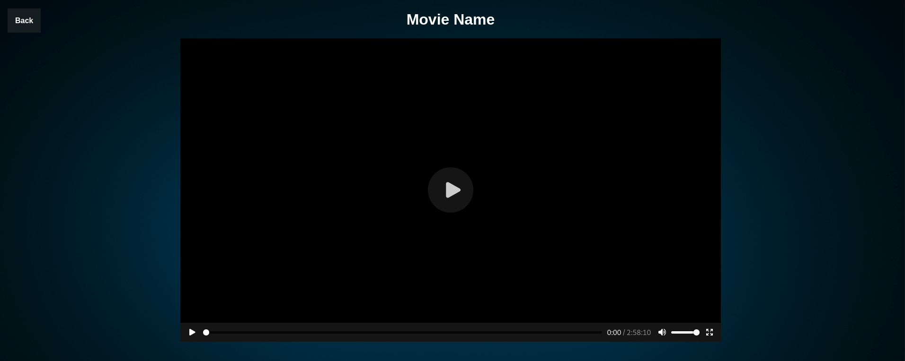
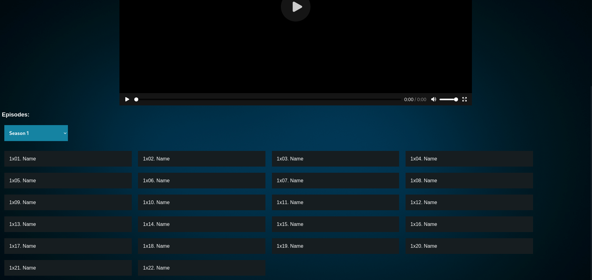
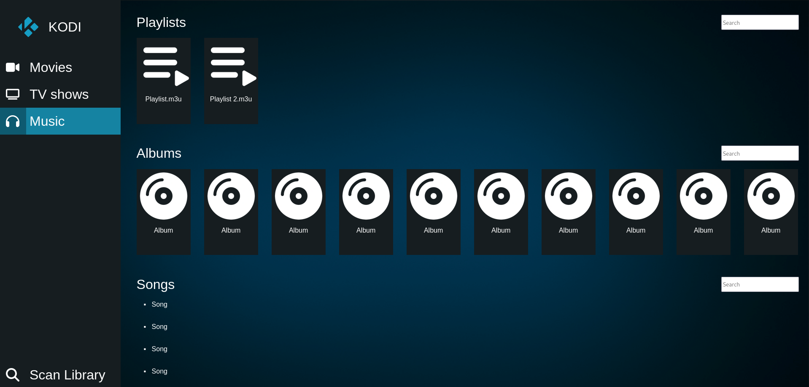
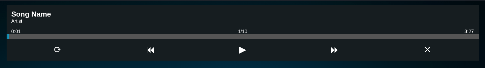

# Kodi-Streaming
A webpage to stream the content from your Kodi install to other devices

This is a simple web viewer implementation that can really simply be added to any KODI install and allows viewing of the contents of the library from other devices. 
Therefore this effectively converts any Kodi install into a streaming server to stream media to any device on the network.

## How to install:
To install this, first a few settings may need to be changed in Kodi.

- Go to Settings -> Services -> Control (If the view needs to be set to "Normal" or higher - In "Basic" the Control tab is not available)
- Turn on "Allow remote control via HTTP"
- Take note of the Port - if there are no other webservers on the device you may want to set the port to 80
- Make sure "Require authentication" is enabled
- Set a Username and Password (the default is "kodi" for both) - you will need these settings later
- Select a web interface - which one you select does not matter
- Make sure "Allow remote control from applications on this system" is enabled

- Locate the files of the webinterface you selected - these are found in the addons folder for your Kodi install
  - on Linux: ~/.kodi/addons/webinterface.chorus
  - on Windows: C:\Users\\\<Username>\AppData\Roaming\Kodi\addons\webinterface.chorus
  - the last part will be different depending on your web interface

- Copy the kodi.html file from this repository into the web interface folder
- Optionally also copy the favicon.ico file into the web interface folder (this is the small icon you will see in the browser tab)

- Open the kodi.html file in a text editor
- Go to the beginning of the script (line 662)
- Change the settings to match your Kodi install:
  - kodiAuth: change "kodi:kodi" to the username and password you set in the Kodi settings in the format "username:password"
  - kodiAddress: change this to the IP Address of the device your Kodi install is running on and the port you set in the settings in the format "http://\<IP Address>:\<Port>/"
  - Make sure the device has a static IP Address (this can be configured either on the device itself or in your router)

- Save the changes

Thats it! 
Now you can stream your Kodi library to any device on the same network! 

## UI Design / How to watch
Simply open a tab in your browser and navigate to "http://\<IP Address>:\<Port>/kodi.html" - The IP address and port being the same you entered in the file. 
If you set the port to 80, you can simply do "http://\<IP Address>/kodi.html" instead.

You should now see a interface similar to the default Kodi skin

You will see the correct names for everything as well as the correct images.  
I have removed them for these screenshots for privacy - It is not anyones business what content I have in my library.

The UI follows the basic design of the default Kodi skin closely, though some things have been changed for better usability. 
The entire UI is responsive and should work well on almost any device.

### Movies
Watching movies is simple - in the "Movies" tab, click on the movie you want to watch. This brings up a new page with a video player which will play the movie you selected. 

The "Back" button in the top left corner brings you back to the main page.

### TV Shows
The UI for watching TV shows is very similar to that for movies. Clicking a show brings up a new page with a video player in the middle and a back button in the top left corner. 

Underneath the video player is a selection for the season and episode of the show. 
The season is selected in a dropdown menu. 
For large screens (PC/Laptop/most Tablets in Landscape) the episodes are then listed as individual buttons below. Clicking one of them will load the selected episode in the video player and you can start watching. 
For smaller screens like on phones, the episode is selected in a second dropdown menu (that way you dont have to scroll around so much on a small screen).

### Music
The Music tab has 3 sections: Playlists, Albums and Songs 

The Playlists and Albums sections show available playlists/albums as cards in a horizontally scrollable list. 
Album cards will show the album cover if available. 
The Songs section is a vertically scrolling list of all songs in your library. 
All three sections have a search box on the right side, which allows you to search for anything in that section. 
Clicking on a playlist, album or song will open a player at the top of the page, which will play the selected music. 
Please note that modern browsers may have autoplay disabled, so you may need to click the play button once to start playing the music.

#### The Player
The music player has different features available depending on what is playing.

When playing a single song, only play/pause and repeat are available. 
When playing a playlist or album, additionally available functions are: skipping to the previous track, skipping to the next track, playing in random order and the repeat function is expanded to repeat a single track or the entire album/playlist. 
Additionally when playing albums or playlists the current track number as well as the total number of tracks are displayed in the middle above the progress bar

Regardless of mode, clicking anywhere on the progress bar will jump to the point in the track.

### The Scan Library Button
Clicking the scan library button in the bottom right corner will tell Kodi to rescan all your libraries and sources for new content. 
Please note that there is no feedback to tell you when Kodi is done scanning your library, as that is not a feature of the Kodi API at this point. Due to this, the page will not update when new content is found. It is up to you to wait a little while after clicking the button and then manually reload the page in your browser to update it.

## Avoid WiFi to connect your Kodi device!
When using this it is highly advisable that you connect the device that is running Kodi with a wired network connection ideally directly to your router! While it will likely make little difference if the device you are watching on is connected via WiFi or via a wired connection, it will make a significant difference for the device that is running Kodi! 
In general, the better the network connection between your device and Kodi, the better your streaming experience will be and the better the network connection of Kodi, the more simultaneous streams will be possible. A wired connection is almost universally always better then a WiFi connection.

## A Note on loading times
Generally speaking, modern devices and network connections are going to be fast enough to stream high-quality video with no issues, especially in your local network at home. Some things can however take a bit of time depending on your connection, as well as the speed of the device running Kodi. 
When loading the page for the first time, especially the images can take a few seconds to fully load in. 
Additionally once you click on something to watch or listen to, it can take a few seconds for the video/audio to load, but for the most part you should not ever run into buffering issues once you have started watching/listening.

Nevertheless, I will note here that Kodi does not transcode media! If you put a movie in 4k into your Kodi library, you will always be watching it in 4k, regardless of your device and there is no option to change the quality. Thankfully even a 5 year old phone or a 10 year old laptop should be more then capable of playing back and streaming even such high quality files in your local network at home. 
Should you be running into issues with buffering, my best advise (apart from checking your network connection) would be to just transcode your media to a slightly lower quality before putting it into your Kodi library.

## A Note on streaming to external networks
Usually this page will only be accessible from the local network that the device running Kodi is on. So eg everywhere in your house, but not from eg a hotel. 
While it is possible to port forward the correct port through your router and then use a DDNS service to access it from anywhere on the internet, I would advise against this. 
If you still want to have access to your media library from anywhere in the world, I would advise you to use a VPN. 
Most modern routers have VPN functionality built in, which allows you to create a VPN on your router and then set up a corresponding App/Program on your Laptop/Tablet/Phone to connect to this VPN. This will effectively put your device into your home network regardless of where you are and comes with the benefit of a secure, encrypted connection, which is a lot safer then exposing your Kodi device to the public internet.

When you are streaming to somewhere outside your home, your internet connection will of course impact how well this will work in a major capacity. 
This should be pretty obvious, but if you are somewhere in the middle of nowhere and only barely have a 3G mobile network connection, you will have trouble streaming video, especially high-quality video!

## Why use this and not Plex, Jellyfin or similar
Plex and Jellyfin are media streaming services that you can install on your own devices and that are built exactly for this kind of thing. 
But personally I see 2 main reasons to use Kodi (which is not exactly built for streaming to other devices) instead:
### Power and processing requirements: 
Plex, Jellyfin and similar transcode all media you add to them to a variety of qualities - that is one of their main features, but it also requires considerable processing power and with that considerable amounts of electric power. You can run a Kodi installation on a modern Raspberry Pi minicomputer that takes at most 35 Watts of power. You would not be able to run Plex or Jellyfin on that, or at least not very well. Additionally nowadays it is not really necessary to transcode videos to lower quality versions for streaming as network speeds and devices have gotten powerful enough to easily handle even large high-quality video streaming
### Direct video output: 
This might be a bit more neache, but it can be very useful to have a direct video output from the device running Kodi. Streaming servers like Plex or Jellyfin are only accessible via the network and do not have a built-in user interface and video output. If you want to watch the content of your library on your TV, you would need a TV with built-in support for Plex or Jellyfin or a separate device with the sole purpose of making that available, while when using Kodi, you could just connect your TV with a HDMI cable to the device running Kodi.